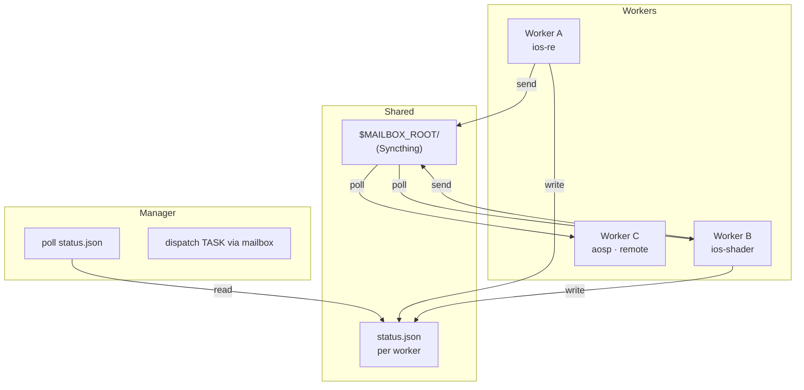
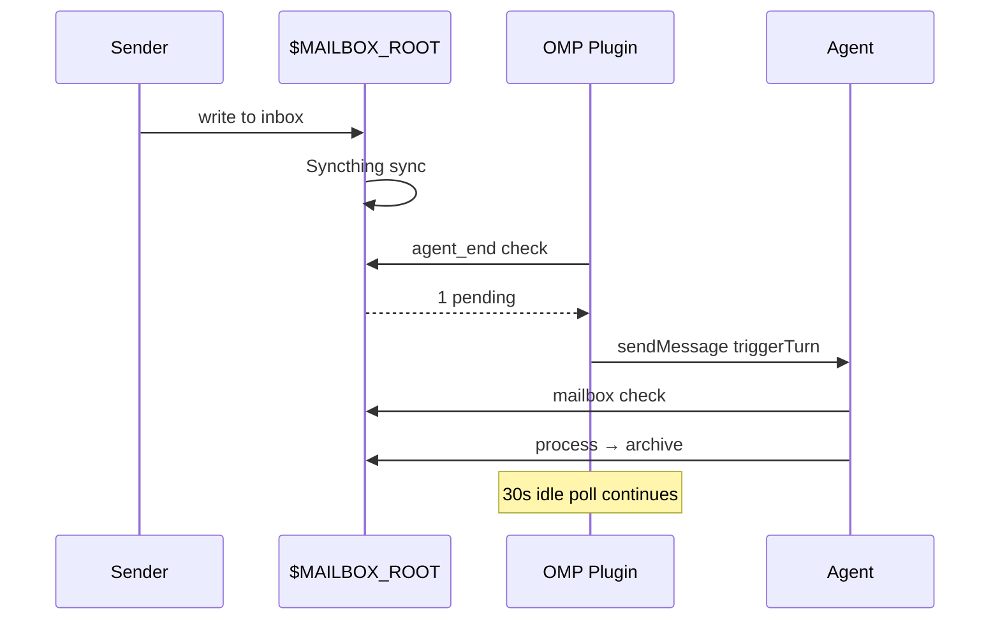

# tmux-agent-skills

OMP skills + standalone CLI for **tmux-agent-manager v3** — a thin orchestration contract for multi-agent file-system IPC via Syncthing.



## Usage Scenarios

### 1. Worker-to-Worker Collaboration

```bash
# Send findings
mailbox send --from ios-re --to ios-shader \
  --subject "Blur weights: CoreImage vs Metal confirmed" \
  --body "Three paths: CoreImage erf, Metal Gaussian, Skia separable"

# Check inbox
mailbox check --worker ios-shader

# Update status
mailbox status --worker ios-shader --state BUSY \
  --current-task "Applying vibrant_light to glass shader" \
  --last-conclusion "PSNR baseline 52.4, target >60"

# Notify peer when done
mailbox send --from ios-shader --to ios-re \
  --kind REPORT --subject "vibrant_light: PSNR 48.9 dB"
```

### 2. Manager Monitoring

```bash
# Quick status of all workers
for w in ios-re ios-shader aosp hyperos; do
  echo -n "$w: "
  cat $MAILBOX_ROOT/$w/status.json | python3 -c "import json,sys; d=json.load(sys.stdin); print(d['state'])"
done
```

### 3. Remote Worker (SSH, no send-keys)

Remote workers rely entirely on mailbox + polling:

```bash
# Remote worker checks inbox at boundaries
mailbox check --worker aosp
# Updates status for Manager
mailbox status --worker aosp --state BUSY --current-task "DDRE analysis"
```

## Notification Flow



## Directory Structure

| Path | Purpose |
|---|---|
| `manager/SKILL.md` | Full Manager protocol (v2 mailbox, dispatch, monitoring) |
| `manager/OPERATIONS.md` | Operations guide (launch, reconcile, recovery) |
| `manager/CHEATSHEET.md` | Quick command reference |
| `worker/SKILL.md` | Worker protocol (INIT/TASK, mailbox, status lifecycle) |
| `tools/mailbox` | Standalone CLI — send/check/clear/stats (Python, zero deps) |
| `tools/mailbox-hook` | Runner integration — pending detection for any runner |

## Mailbox CLI

```bash
# Send to peer
mailbox send --from <id> --to <id> --subject "..." --body "..."

# Check inbox (read oldest, validate, move to archive)
mailbox check --worker <id>

# Update status
mailbox status --worker <id> --state BUSY|IDLE|DONE|BLOCKED \
  --current-task "..." --last-conclusion "..."

# Clear archive + prune corrupt
mailbox clear --worker <id> --prune-corrupt --older-than-days 30

# Stats
mailbox stats --worker <id>
```

## Installation

```bash
git clone https://github.com/comicchang/tmux-agent-skills.git
export PATH="$PATH:$(pwd)/tmux-agent-skills/tools"
```

## License

MIT
